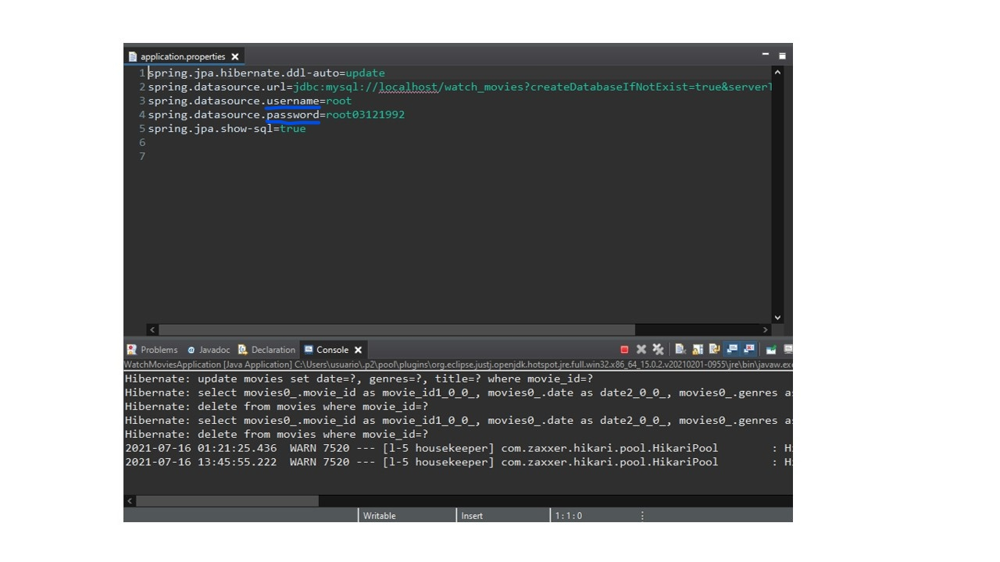
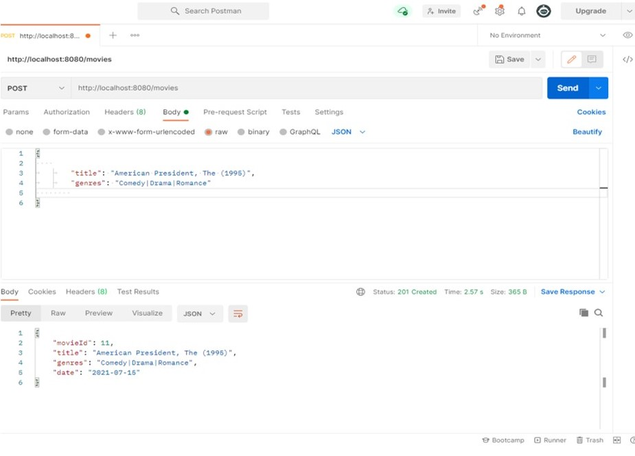
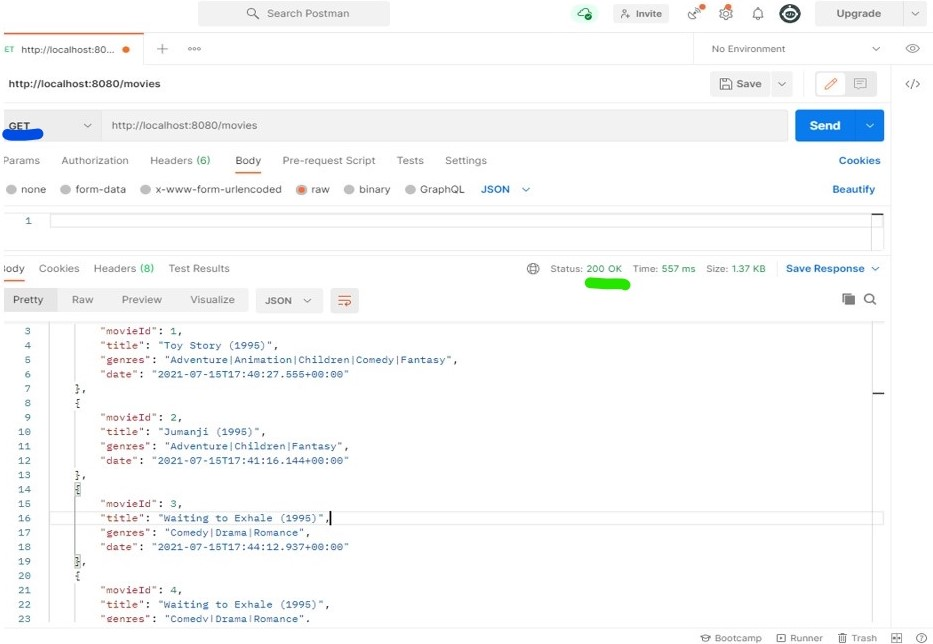

# development-test

# Sobre o projeto
watchMovie é uma aplicação REST (back-end) contruída com o intuito de listar, inserir, atualizar e excluir (CRUD) filmes de uma base de dados.
A aplicação consiste em um teste que faz parte do processo seleivo da empresa TKSolution. 

# Tecnologias utilizadas
<h2>BACK-END</h2>

<h3>Linguagem JAVA; 
Framework SPRING;
Banco de dados(local) MYSQL WORKBENCH;
Testes de API POSTMAN; </h3>

# Como executar o projeto

<h3>1 - Clone o repositório </h3>

<h3>2 - Import o projeto em sua IDE </h3> 

<h3>3 - Rode o projeto - clicando com o botão direito em cima da aplicação principal > Run As > Java Aplication </h3>

<h3>4 - Abra a pasta src/main/resources e altere Aplication properties - Alterar username e password do seu banco de dados (MySQL Workbench) </h3>
   

   
   

   
<h3>5 - Abra o Postman </h3>

<h3>6 - Para inserir um filme (POST-CREATE):</h3>
   Usando a URL http://localhost:8080/movies, selecione no campo de ação a opção "POST" e no campo abaixo adicione as informações no formato JSON, clique no botão "SEND".
   

   
   

   
<h3>7 - Para buscar todos os filmes inseridos (GET-READ): </h3>
    Usando a URL http://localhost:8080/movies, selecione no campo de ação a opção "GET" e clique no botão "SEND", conforme imagem a seguir: 
    

    
    

    <h4>Vale dizer que pode ser feita uma busca pelo ID, usando a URL http://localhost:8080/movies/{moviesId}, conforme demonstrado a seguir:</h4>
    

    
    

    <h4>Pode-se também fazer a busca por título, usando a URL http://localhost:8080/movies/title/{title}, conforme demonstrado a seguir: </h4>
    

    
    

    <h4>Não é preciso buscar pelo título completo</h4>
    

    
    

    <h3>Pode ser feita a busca por gênero, usando a URL http://localhost:8080/movies/genres/{genres}, conforme demonstrado a seguir:</h3>
    

    
    

    <h4>Não é preciso buscar pelo nome completo do gênero </h4>
    

    
    

    
<h3>8 - Para atualizar um dado inserido (PUT-UPDATE): </h3>
     Usando a URL http://localhost:8080/movies, selecione no campo de ação a opção "PUT" e no campo abaixo escreva a alteração que deseja fazer em formato JSON, lembrando de preencher as informações de {movieId},{title} para que seja identificado o dado exato que deseja alterar.
     

     
     

     
<h3>9 - Para deletar um filme inserido (DELETE):</h3>
     Usando a URL http://localhost:8080/movies/{moviesId} (onde {moviesId} é o ID do filme que deseja deletar), selecione no campo de ação a opção "DELETE" e clique no botão "SEND"
      

     
     

    

# Autor

Washington Albuquerque de Moura

Linkedin: linkedin.com/in/washington-albuquerque-729223aa/
GitHub: https://github.com/AlbuquerqueMouraW
